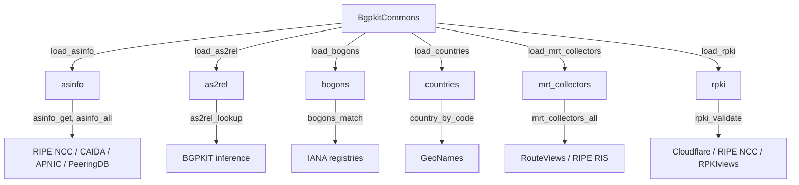

# BGPKIT Commons

[](https://crates.io/crates/bgpkit-commons)
[](https://docs.rs/bgpkit-commons)
[](https://raw.githubusercontent.com/bgpkit/bgpkit-commons/main/LICENSE)
[](https://discord.gg/XDaAtZsz6b)

`bgpkit-commons` is a library for common BGP-related data and functions. It provides a unified
interface to multiple BGP data sources through a lazy-loading architecture — modules are
independently enabled via feature flags and data is only fetched when explicitly requested.

## Architecture



Each module is gated by a feature flag. The `all` feature (default) enables everything.
Data is fetched on the first `load_xxx()` call and kept in memory until `reload()` is called.

## Modules

| Module | Feature | Data Sources | Key Functions |
|--------|---------|--------------|---------------|
| [`asinfo`] | `asinfo` | RIPE NCC, CAIDA as2org, APNIC, IIJ IHR, PeeringDB | `asinfo_get`, `asinfo_all`, `asinfo_are_siblings` |
| [`as2rel`] | `as2rel` | BGPKIT AS relationship inference | `as2rel_lookup` |
| [`bogons`] | `bogons` | IANA special registries | `bogons_match`, `bogons_match_prefix`, `bogons_match_asn` |
| [`countries`] | `countries` | GeoNames | `country_by_code`, `country_by_code3`, `country_by_name` |
| [`mrt_collectors`] | `mrt_collectors` | RouteViews, RIPE RIS | `mrt_collectors_all`, `mrt_collector_peers_all` |
| [`rpki`] | `rpki` | Cloudflare, RIPE NCC, RPKIviews | `rpki_validate`, `rpki_validate_check_expiry`, `rpki_lookup_by_prefix` |

## Quick Start

```toml
[dependencies]
bgpkit-commons = "0.10"
```

```rust
use bgpkit_commons::BgpkitCommons;

let mut commons = BgpkitCommons::new();

// Load the modules you need
commons.load_bogons().unwrap();
commons.load_asinfo(false, false, false, false).unwrap();

// Access the data
if let Ok(is_bogon) = commons.bogons_match("23456") {
    println!("ASN 23456 is bogon: {}", is_bogon);
}
if let Ok(Some(info)) = commons.asinfo_get(13335) {
    println!("AS13335: {} ({})", info.name, info.country);
}
```

## Examples

### RPKI Validation

```rust
use bgpkit_commons::BgpkitCommons;

let mut commons = BgpkitCommons::new();
commons.load_rpki(None).unwrap(); // None = real-time from Cloudflare

let result = commons.rpki_validate(13335, "1.1.1.0/24").unwrap();
println!("Validation result: {:?}", result);
```

### Historical RPKI Data

```rust
use bgpkit_commons::BgpkitCommons;
use bgpkit_commons::rpki::{HistoricalRpkiSource, RpkiViewsCollector};
use chrono::NaiveDate;

let mut commons = BgpkitCommons::new();
let date = NaiveDate::from_ymd_opt(2024, 1, 4).unwrap();

// From RIPE NCC historical archives
commons.load_rpki_historical(date, HistoricalRpkiSource::Ripe).unwrap();

// Or from an RPKIviews collector
let source = HistoricalRpkiSource::RpkiViews(RpkiViewsCollector::SobornostNet);
commons.load_rpki_historical(date, source).unwrap();
```

Available RPKIviews collectors: `SobornostNet` (default), `MassarsNet`, `AttnJp`, `KerfuffleNet`.

### AS Information with Builder

```rust
use bgpkit_commons::BgpkitCommons;

let mut commons = BgpkitCommons::new();
let builder = commons.asinfo_builder()
    .with_as2org()
    .with_peeringdb();
commons.load_asinfo_with(builder).unwrap();

if let Ok(are_siblings) = commons.asinfo_are_siblings(13335, 132892) {
    println!("AS13335 and AS132892 are siblings: {}", are_siblings);
}
```

### Direct Module Access

All modules can be used directly without `BgpkitCommons`:

```rust
use bgpkit_commons::bogons::Bogons;
use bgpkit_commons::rpki::RpkiTrie;

let bogons = Bogons::new().unwrap();
let trie = RpkiTrie::from_cloudflare().unwrap();
```

## Feature Flags

| Feature | Description |
|---------|-------------|
| `asinfo` | AS information: names, countries, organizations, population, hegemony |
| `as2rel` | AS relationship data |
| `bogons` | Bogon prefix and ASN detection |
| `countries` | Country information lookup |
| `mrt_collectors` | MRT collector metadata |
| `rpki` | RPKI validation (ROA and ASPA) |
| `all` *(default)* | Enables all modules |

For a minimal build:

```toml
[dependencies]
bgpkit-commons = { version = "0.10", default-features = false, features = ["bogons", "rpki"] }
```

## License

MIT
