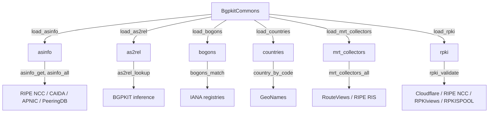

# BGPKIT Commons

[](https://crates.io/crates/bgpkit-commons)
[](https://docs.rs/bgpkit-commons)
[](https://raw.githubusercontent.com/bgpkit/bgpkit-commons/main/LICENSE)
[](https://discord.gg/XDaAtZsz6b)

`bgpkit-commons` is a library for common BGP-related data and functions. It provides a unified
interface to multiple BGP data sources through a lazy-loading architecture — modules are
independently enabled via feature flags and data is only fetched when explicitly requested.

## Architecture


```mermaid
graph TD
    B[BgpkitCommons]

    B -->|load_asinfo| M1[asinfo]
    B -->|load_as2rel| M2[as2rel]
    B -->|load_bogons| M3[bogons]
    B -->|load_countries| M4[countries]
    B -->|load_mrt_collectors| M5[mrt_collectors]
    B -->|load_rpki| M6[rpki]

    M1 -->|asinfo_get, asinfo_all| A1[RIPE NCC / CAIDA / APNIC / PeeringDB]
    M2 -->|as2rel_lookup| A2[BGPKIT inference]
    M3 -->|bogons_match| A3[IANA registries]
    M4 -->|country_by_code| A4[GeoNames]
    M5 -->|mrt_collectors_all| A5[RouteViews / RIPE RIS]
    M6 -->|rpki_validate| A6[Cloudflare / RIPE NCC / RPKIviews / RPKISPOOL]
```

Each module is gated by a feature flag. The `all` feature (default) enables everything.
Data is fetched on the first `load_xxx()` call and kept in memory until `reload()` is called.
The Cloudflare RPKI module also exposes a validator-aware polling API for avoiding full
re-downloads when the source has not changed; see [Conditional RPKI loading](#conditional-rpki-loading).

## Modules

| Module | Feature | Data Sources | Key Functions |
|--------|---------|--------------|---------------|
| [`asinfo`] | `asinfo` | RIPE NCC, CAIDA as2org, APNIC, IIJ IHR, PeeringDB | `asinfo_get`, `asinfo_all`, `asinfo_are_siblings` |
| [`as2rel`] | `as2rel` | BGPKIT AS relationship inference | `as2rel_lookup` |
| [`bogons`] | `bogons` | IANA special registries | `bogons_match`, `bogons_match_prefix`, `bogons_match_asn` |
| [`countries`] | `countries` | GeoNames | `country_by_code`, `country_by_code3`, `country_by_name` |
| [`mrt_collectors`] | `mrt_collectors` | RouteViews, RIPE RIS | `mrt_collectors_all`, `mrt_collector_peers_all` |
| [`rpki`] | `rpki` | Cloudflare, RIPE NCC, RPKIviews, RPKISPOOL | `rpki_validate`, `rpki_validate_check_expiry`, `rpki_lookup_by_prefix` |

### RPKI data sources

| Source | Data and scope | Wire/file compression | Main entry points |
|--------|----------------|-----------------------|-------------------|
| Cloudflare | Current aggregate ROA, ASPA, and BGPsec data | HTTP `Content-Encoding: gzip` | `RpkiTrie::from_cloudflare`, `RpkiTrie::from_cloudflare_conditional` |
| RIPE NCC | Historical data from all five RIRs | `output.json.xz` | `RpkiTrie::from_ripe_historical`, `list_ripe_files` |
| RPKIviews | Historical collector-specific snapshots | `.tgz` (gzip-compressed tar) | `RpkiTrie::from_rpkiviews`, `list_rpkiviews_files` |
| RPKISPOOL | Historical CCR snapshots from a collector | `.tar.zst` | `RpkiTrie::from_rpkispools`, `parse_rpkispools_archive` |

Collector-specific sources represent the selected collector's vantage point and snapshot;
they should not be interpreted as a complete global view by themselves.

## Quick Start

```toml
[dependencies]
bgpkit-commons = "0.10"
```

```rust
use bgpkit_commons::BgpkitCommons;

let mut commons = BgpkitCommons::new();

// Load the modules you need
commons.load_bogons().unwrap();
commons.load_asinfo(false, false, false, false).unwrap();

// Access the data
if let Ok(is_bogon) = commons.bogons_match("23456") {
    println!("ASN 23456 is bogon: {}", is_bogon);
}
if let Ok(Some(info)) = commons.asinfo_get(13335) {
    println!("AS13335: {} ({})", info.name, info.country);
}
```

## Examples

### RPKI Validation

```rust
use bgpkit_commons::BgpkitCommons;

let mut commons = BgpkitCommons::new();
commons.load_rpki(None).unwrap(); // None = real-time from Cloudflare

let result = commons.rpki_validate(13335, "1.1.1.0/24").unwrap();
println!("Validation result: {:?}", result);
```

### Conditional RPKI loading

For a long-running service that polls Cloudflare repeatedly, retain the validators from the
previous successful load. A matching validator produces `Ok(None)` from the next request, so
the large JSON payload is not downloaded or parsed again:

```rust,no_run
use bgpkit_commons::rpki::RpkiTrie;

let mut etag = None;
let mut last_modified = None;

if let Some(load) = RpkiTrie::from_cloudflare_conditional(
    etag.as_deref(),
    last_modified.as_deref(),
)? {
    etag = load.etag.clone();
    last_modified = load.last_modified.clone();
    // Swap `load.trie` into the serving process after the complete rebuild.
} // `None` means HTTP 304: keep the currently served trie.
# Ok::<(), bgpkit_commons::BgpkitCommonsError>(())
```

`BgpkitCommons::reload()` is not validator-aware: it performs a regular full reload. Use the
direct `RpkiTrie` conditional API when polling needs ETag/Last-Modified reuse.

### Historical RPKI Data

```rust
use bgpkit_commons::BgpkitCommons;
use bgpkit_commons::rpki::{HistoricalRpkiSource, RpkiViewsCollector};
use chrono::NaiveDate;

let mut commons = BgpkitCommons::new();
let date = NaiveDate::from_ymd_opt(2024, 1, 4).unwrap();

// From RIPE NCC historical archives
commons.load_rpki_historical(date, HistoricalRpkiSource::Ripe).unwrap();

// Or from an RPKIviews collector
let source = HistoricalRpkiSource::RpkiViews(RpkiViewsCollector::SobornostNet);
commons.load_rpki_historical(date, source).unwrap();

// Or from RPKISPOOL (CCR format, parses faster)
use bgpkit_commons::rpki::RpkiSpoolsCollector;
let source = HistoricalRpkiSource::RpkiSpools(RpkiSpoolsCollector::default());
commons.load_rpki_historical(date, source).unwrap();
```

Available RPKIviews collectors: `SobornostNet` (default), `MassarsNet`, `AttnJp`, `KerfuffleNet`.

Available RPKISPOOL collectors: `SobornostNet` (default), `AttnJp`, `KerfuffleNet`.

### AS Information with Builder

```rust
use bgpkit_commons::BgpkitCommons;

let mut commons = BgpkitCommons::new();
let builder = commons.asinfo_builder()
    .with_as2org()
    .with_peeringdb();
commons.load_asinfo_with(builder).unwrap();

if let Ok(are_siblings) = commons.asinfo_are_siblings(13335, 132892) {
    println!("AS13335 and AS132892 are siblings: {}", are_siblings);
}
```

### Direct Module Access

All modules can be used directly without `BgpkitCommons`:

```rust
use bgpkit_commons::bogons::Bogons;
use bgpkit_commons::rpki::RpkiTrie;

let bogons = Bogons::new().unwrap();
let trie = RpkiTrie::from_cloudflare().unwrap();
```

## Feature Flags

| Feature | Description |
|---------|-------------|
| `asinfo` | AS information: names, countries, organizations, population, hegemony |
| `as2rel` | AS relationship data |
| `bogons` | Bogon prefix and ASN detection |
| `countries` | Country information lookup |
| `mrt_collectors` | MRT collector metadata |
| `rpki` | RPKI validation (ROA and ASPA) |
| `all` *(default)* | Enables all modules |

For a minimal build:

```toml
[dependencies]
bgpkit-commons = { version = "0.10", default-features = false, features = ["bogons", "rpki"] }
```

Examples requiring a particular module are feature-gated in `Cargo.toml`. For example:

```bash
cargo run --example rpki_historical --features rpki
cargo run --example rpkispools --features rpki
cargo run --example as2org --features asinfo,countries
```

## Operational notes

- Loading data requires network access; sources are fetched lazily when their load method is called.
- The Cloudflare RPKI payload is large in memory even when HTTP gzip substantially reduces transfer size.
- `.gz`, `.xz`, and `.bz2` URL suffixes are decompressed by oneio. RPKIviews `.tgz` archives are
  streamed and require the `gunzip` executable to be available in `PATH`.
- PeeringDB loading can use `PEERINGDB_API_KEY`; when unset, the client sends no empty API-key header.
- `reload()` replaces already-loaded module data by fetching it again. It does not provide an
  atomic swap or conditional HTTP polling for the RPKI module.

## License

MIT
